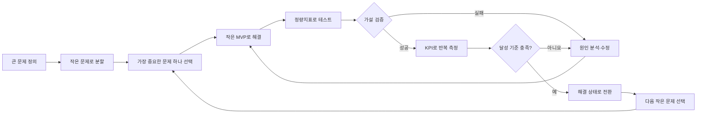
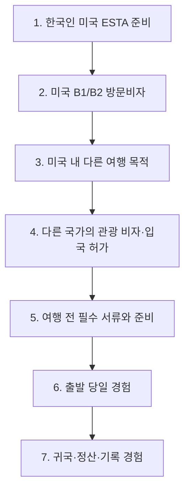

# 비자비스 제품 비전과 문제 해결 로드맵

> **큰 문제:** 여행의 처음과 끝을 기분 좋게 만든다.

| 문서 항목 | 내용 |
|---|---|
| 가칭 | 비자비스(Be Jarvis) |
| 현재 집중 영역 | 여행 전 비자·입국 허가 준비 |
| 첫 번째 작은 문제 | 한국 국적 성인의 미국 관광 목적 ESTA 신청 준비 |
| 실행 원칙 | 한 번에 작은 문제 하나만 해결하고, KPI 달성 후 다음 문제로 이동 |
| 상세 MVP | [PRD.md](./PRD.md) |

## 1. 우리가 일하는 순서



### 핵심 규칙

1. 기능이 아니라 사용자의 문제에서 시작한다.
2. 동시에 여러 문제를 해결하지 않는다.
3. 해결 여부는 의견이 아니라 행동 데이터로 판단한다.
4. 정량지표는 실험 결과를 측정하고, KPI는 해결 상태를 지속적으로 관리한다.
5. KPI를 한 번 넘긴 것만으로 달성 처리하지 않는다.
6. 핵심 KPI와 안전 지표를 연속 두 차례 만족해야 다음 문제로 이동한다.

## 2. 큰 문제 정의

### 제품 비전

여행자가 출발을 준비하는 순간부터 여행을 마무리하는 순간까지, 복잡한 절차와 불확실성 때문에 기분을 망치지 않도록 돕는다.

### 사용자가 원하는 최종 상태

- 무엇을 준비해야 하는지 명확히 안다.
- 중요한 절차를 빠뜨리지 않았다고 확신한다.
- 어려운 행정·예약·이동 정보를 자신의 언어로 이해한다.
- 문제가 생겨도 다음 행동을 바로 알 수 있다.
- 여행을 시작하고 마칠 때 피로보다 안도감과 만족감이 크다.

### 북극성 지표

**기분 좋은 여행 과업 완료율**

다음 세 조건을 모두 만족한 사용자의 비율이다.

1. 현재 여행 과업을 외부 도움 없이 완료했다.
2. 완료 후 `다음 단계로 갈 준비가 됐다`는 응답이 5점 만점에 4점 이상이다.
3. 전체 경험 만족도가 5점 만점에 4점 이상이다.

이 지표는 비자, 출국 준비, 공항 이동, 귀국 정리 등 앞으로 추가되는 모든 작은 문제에 공통으로 적용한다.

## 3. 큰 문제를 작은 문제로 분할

| 여행 단계 | 작은 문제 | 사용자가 겪는 불편 | 가능한 해결 방향 | 현재 상태 |
|---|---|---|---|---|
| 준비 시작 | 입국 자격·비자 | 무엇을 신청해야 하는지 모르고 공식 양식이 어렵다 | 자격 사전 확인, 단계별 작성, 복사 가능한 결과 | **진행 중** |
| 준비 시작 | 여권·필수 서류 | 유효기간과 필수 서류를 빠뜨릴 수 있다 | 목적지별 서류 체크리스트 | 후보 |
| 여행 계획 | 일정 설계 | 정보가 흩어져 있고 동선 결정이 어렵다 | 조건 기반 일정 초안과 충돌 검사 | 후보 |
| 여행 계획 | 예약 비교 | 가격·환불·수하물 조건을 비교하기 어렵다 | 핵심 조건 표준화와 비교 | 후보 |
| 출발 준비 | 보험·통신·환전 | 선택지가 많아 무엇이 필요한지 판단하기 어렵다 | 여행 조건별 준비 추천 | 후보 |
| 출발 준비 | 짐 싸기 | 목적지·날씨·일정에 맞는 준비물을 빠뜨린다 | 개인화된 짐 체크리스트 | 후보 |
| 출발 당일 | 공항 절차 | 체크인·수하물·보안검색 순서가 불안하다 | 시간 기반 출발 당일 가이드 | 후보 |
| 여행 중 | 이동·언어·안전 | 돌발 상황에서 다음 행동을 찾기 어렵다 | 상황별 즉시 행동 안내 | 후보 |
| 귀국 준비 | 세관·반입 규정 | 신고 여부와 반입 제한을 알기 어렵다 | 귀국 전 확인 체크리스트 | 후보 |
| 여행 종료 | 환불·정산 | 보증금, 환급, 공동경비 정리가 번거롭다 | 귀국 정산 도우미 | 후보 |
| 여행 종료 | 기록·추억 | 사진과 경험이 흩어진 채 끝난다 | 자동 여행 요약과 기록 정리 | 후보 |

후보 순서는 확정 로드맵이 아니다. 현재 작은 문제를 해결한 뒤 실제 사용자 데이터로 다음 문제를 다시 선택한다.

## 4. 작은 문제 선택 기준

각 후보를 5점 척도로 평가한다.

| 평가 항목 | 질문 | 가중치 |
|---|---|---:|
| 고통 강도 | 이 문제 때문에 여행을 포기하거나 큰 스트레스를 받는가? | 35% |
| 발생 빈도 | 목표 사용자에게 얼마나 자주 발생하는가? | 25% |
| 여행 영향 | 해결했을 때 여행의 시작·마무리가 얼마나 좋아지는가? | 25% |
| 빠른 검증 가능성 | 24시간 MVP로 핵심 가설을 시험할 수 있는가? | 15% |

```text
우선순위 점수
= 고통 강도×0.35
+ 발생 빈도×0.25
+ 여행 영향×0.25
+ 빠른 검증 가능성×0.15
```

점수가 가장 높은 문제 하나만 활성 상태로 둔다. 나머지는 후보 목록에 유지한다.

## 5. 현재 작은 문제: 비자·입국 허가

### 5.1 문제 정의

미국 여행을 준비하는 한국 성인은 ESTA 대상 여부와 신청 항목을 이해하기 어렵고, 영문 공식 신청서에 정보를 옮기는 과정에서 누락·형식 오류·불안을 경험한다.

### 5.2 핵심 가설

> 한국어 단계별 폼과 항목별 복사 결과를 제공하면, 사용자는 별도의 사람 도움 없이 ESTA 신청 준비를 완료하고 공식 사이트로 자신 있게 이동할 수 있다.

### 5.3 첫 MVP

- 만 18세 이상 한국 국적자 1명
- 미국 관광 목적, 90일 이하 여행
- ESTA 사전 확인
- 한국어 단계별 입력 폼
- 어려운 항목에 대한 AI 도움
- 선택적 AI 전체 검토
- 사용자 승인 후에만 AI 제안 반영
- 공식 신청서 순서의 항목별 복사 결과
- 공개 데모에서는 가상 정보만 사용
- 사진, 이메일 인증, 결제, 최종 제출은 공식 ESTA 사이트에서 진행

상세 기능과 수용 기준은 [PRD.md](./PRD.md)를 기준으로 한다.

## 6. 작은 문제를 하나씩 클리어하는 방법

### 1단계 — 정의

- 대상 사용자 한 명을 명확히 정한다.
- 사용자가 처한 상황과 막히는 순간을 한 문장으로 적는다.
- 해결할 범위와 하지 않을 범위를 분리한다.

### 2단계 — 최소 해결책

- 문제 해결에 꼭 필요한 기능만 P0로 지정한다.
- 예쁘지만 가설 검증에 필요 없는 기능은 뒤로 미룬다.
- 24시간 안에 외부 사용자가 끝까지 체험할 수 있게 만든다.

### 3단계 — 정량 테스트

- 사용자가 설명 없이 과업을 수행하게 한다.
- 시작, 이탈, 오류, 완료 행동을 측정한다.
- 테스트 전에 통과 기준을 먼저 고정한다.

### 4단계 — 검증

- 결과가 기준 이상이면 해결 방향을 유지한다.
- 일부만 통과하면 가장 큰 이탈 지점 하나를 수정한다.
- 크게 실패하면 기능을 더 붙이지 않고 문제·사용자·가설을 다시 정의한다.

### 5단계 — KPI 운영

- 핵심 KPI, 입력 KPI, 안전 KPI를 함께 본다.
- 평균값만 보지 않고 실패한 사용자의 원인을 기록한다.
- 연속 두 번 목표를 충족할 때까지 같은 문제에 집중한다.

### 6단계 — 달성 및 확장

- 달성 조건을 충족하면 해당 문제를 `해결됨`이 아니라 `관리 중`으로 전환한다.
- 회귀하지 않도록 핵심 KPI를 계속 관찰한다.
- 문제 후보를 다시 평가해 다음 하나를 선택한다.

## 7. 비자 MVP 정량 테스트

### 7.1 첫 번째 테스트

| 항목 | 계획 |
|---|---|
| 참가자 | 목표 사용자와 유사한 성인 5명 |
| 데이터 | 실제 개인정보가 아닌 제공된 가상 정보 |
| 과업 | 첫 화면에서 시작해 결과 복사 화면까지 완료 |
| 진행자 개입 | 사용 방법을 설명하거나 정답을 알려주지 않음 |
| 기록 | 완료 여부, 소요 시간, 오류 위치, 도움 요청, 중단 이유 |

### 7.2 정량지표

| 지표 | 계산 | 첫 목표 |
|---|---|---:|
| 독립 완료율 | 도움 없이 결과 화면에 도달한 사용자 ÷ 시작 사용자 | **80% 이상** |
| 중간 이탈률 | 결과 전에 중단한 사용자 ÷ 시작 사용자 | 20% 이하 |
| 치명적 매핑 오류 | 공식 항목과 잘못 연결된 필수값 수 | **0건** |
| 필수 누락 | 결과 화면에서 빠진 필수 텍스트 항목 수 | **0건** |
| 중앙 완료 시간 | 전체 완료 시간의 중앙값 | 20분 이하 |
| 도움 요청 중앙값 | 사용자별 진행자 도움 요청 횟수의 중앙값 | 2회 이하 |
| 완료 후 준비 자신감 | `공식 사이트로 옮길 준비가 됐다` 1–5점 | 4점 이상 |
| 경험 만족도 | 전체 경험 평가 1–5점 | 4점 이상 |

### 7.3 테스트 중 관찰할 퍼널

```text
랜딩 방문
→ 데모 동의
→ ESTA 사전 확인 완료
→ 첫 입력 섹션 시작
→ 모든 필수 입력 완료
→ 검토 완료
→ 결과 화면 도달
→ 첫 항목 복사
→ 공식 사이트 열기
```

각 단계의 사용자 수를 기록하고 가장 큰 이탈 구간 하나를 다음 수정 대상으로 삼는다.

## 8. 검증 규칙

### 성공

- 독립 완료율 80% 이상
- 치명적 매핑 오류와 필수 누락 0건
- 안전 지표 위반 0건

다음 행동: 가장 큰 마찰 한 가지를 개선하고 더 큰 표본으로 다시 테스트한다.

### 부분 성공

- 사용자는 가치를 이해하지만 특정 단계에서 반복적으로 막힘
- 완료율은 목표 미만이지만 치명적 오류는 없음

다음 행동: 이탈이 가장 큰 단계 하나만 수정하고 같은 조건으로 재시험한다.

### 실패

- 사용자가 서비스 목적을 이해하지 못함
- 결과가 공식 신청에 도움이 되지 않음
- 치명적 오류 또는 신뢰 문제 발생

다음 행동: 기능 추가를 중단하고 사용자·문제·핵심 가설부터 다시 검토한다.

## 9. 비자 단계 KPI

### 핵심 KPI

**ESTA 준비 독립 완료율:** 80% 이상

사용자가 진행자의 도움 없이 사전 확인부터 복사 결과 화면까지 완료한 비율이다.

### 경험 KPI

| KPI | 목표 |
|---|---:|
| 완료 후 준비 자신감 | 평균 4.0/5 이상 |
| 전체 경험 만족도 | 평균 4.0/5 이상 |
| 중앙 완료 시간 | 20분 이하 |

### 품질 KPI

| KPI | 목표 |
|---|---:|
| 공식 필수 항목 누락 | 0건 |
| 치명적 항목 매핑 오류 | 0건 |
| 사용자 승인 없는 AI 수정 | 0건 |
| AI 장애로 인한 전체 과업 실패 | 0건 |

### 안전 KPI

| KPI | 목표 |
|---|---:|
| 공개 데모의 서버 개인정보 저장 | 0건 |
| AI 미동의 사용자의 신청값 외부 전송 | 0건 |
| 미국 정부 공식 서비스 오인 사례 | 0건 |
| 승인·입국 보장으로 해석되는 문구 | 0건 |

## 10. 달성 기준

비자·입국 허가 문제는 다음 조건을 **연속 두 번의 테스트 라운드**에서 모두 만족했을 때 1차 달성으로 처리한다.

- [ ] 독립 완료율 80% 이상
- [ ] 완료 후 준비 자신감 평균 4.0/5 이상
- [ ] 경험 만족도 평균 4.0/5 이상
- [ ] 공식 필수 항목 누락 0건
- [ ] 치명적 항목 매핑 오류 0건
- [ ] 사용자 승인 없는 AI 수정 0건
- [ ] 개인정보·외부 전송·공식기관 오인 안전 사고 0건
- [ ] 실패 사용자에게 공통으로 나타나는 P0 장애가 없음

### 달성 후 상태

`집중 해결 중 → KPI 안정화 → 관리 중`

`관리 중`이 된 뒤에도 공식 양식 변경과 핵심 KPI 회귀를 감시한다. 이후에만 다음 작은 문제를 활성화한다.

## 11. 확장 단계



위 순서는 방향을 보여주는 가안이다. 각 단계가 끝날 때 작은 문제 후보를 다시 점수화하며, 사용자 고통과 데이터가 더 높은 후보를 가리키면 순서를 바꾼다.

## 12. 현재 실행 보드

| 단계 | 상태 | 산출물 또는 통과 조건 |
|---|---|---|
| 큰 문제 정의 | 완료 | 여행의 처음과 끝을 기분 좋게 만든다 |
| 작은 문제 분할 | 완료 | 여행 단계별 문제 지도 |
| 첫 문제 선택 | 완료 | 한국인의 미국 관광 ESTA 준비 |
| 요구사항 구체화 | 완료 | [PRD.md](./PRD.md) |
| 24시간 MVP 구현 | 대기 | 공개 데모 링크 |
| 정량 테스트 | 대기 | 성인 사용자 5명 테스트 결과 |
| 1차 검증 | 대기 | 독립 완료율 80%, 치명적 오류 0건 |
| KPI 안정화 | 대기 | 연속 두 라운드 달성 |
| 다음 문제 선택 | 대기 | 후보 재점수화 후 한 문제 선택 |

## 13. 향후 작은 문제 정의 템플릿

새로운 문제를 시작할 때 아래 항목을 한 페이지 안에 작성한다.

```markdown
# 작은 문제: [이름]

## 대상 사용자
[누가 이 문제를 겪는가]

## 문제 상황
[언제, 어디서, 무엇 때문에 막히는가]

## 현재 대안
[지금은 어떻게 해결하고 있으며 무엇이 불편한가]

## 핵심 가설
[어떤 해결책이 어떤 행동 변화를 만들 것인가]

## MVP 범위
- 포함:
- 제외:

## 정량 테스트
- 참가자:
- 과업:
- 측정 이벤트:
- 통과 기준:

## KPI
- 핵심 KPI:
- 경험 KPI:
- 품질 KPI:
- 안전 KPI:

## 달성 조건
[연속 몇 회, 어떤 수치를 만족해야 하는가]

## 검증 결과
- 성공 / 부분 성공 / 실패
- 근거:
- 다음 행동:
```

## 14. 한 문장 운영 원칙

> **가장 아픈 작은 문제 하나를 선택하고, 사용자가 실제로 해결됐다고 행동으로 증명할 때까지 집중한다. 달성한 뒤에만 다음 문제로 이동한다.**

